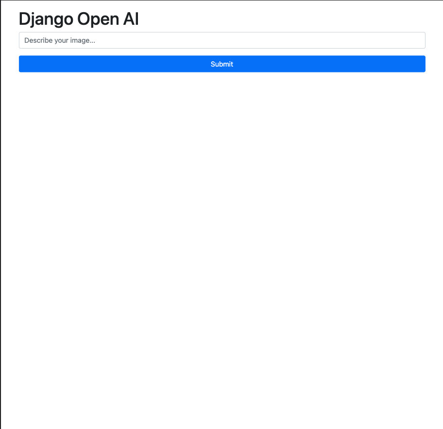
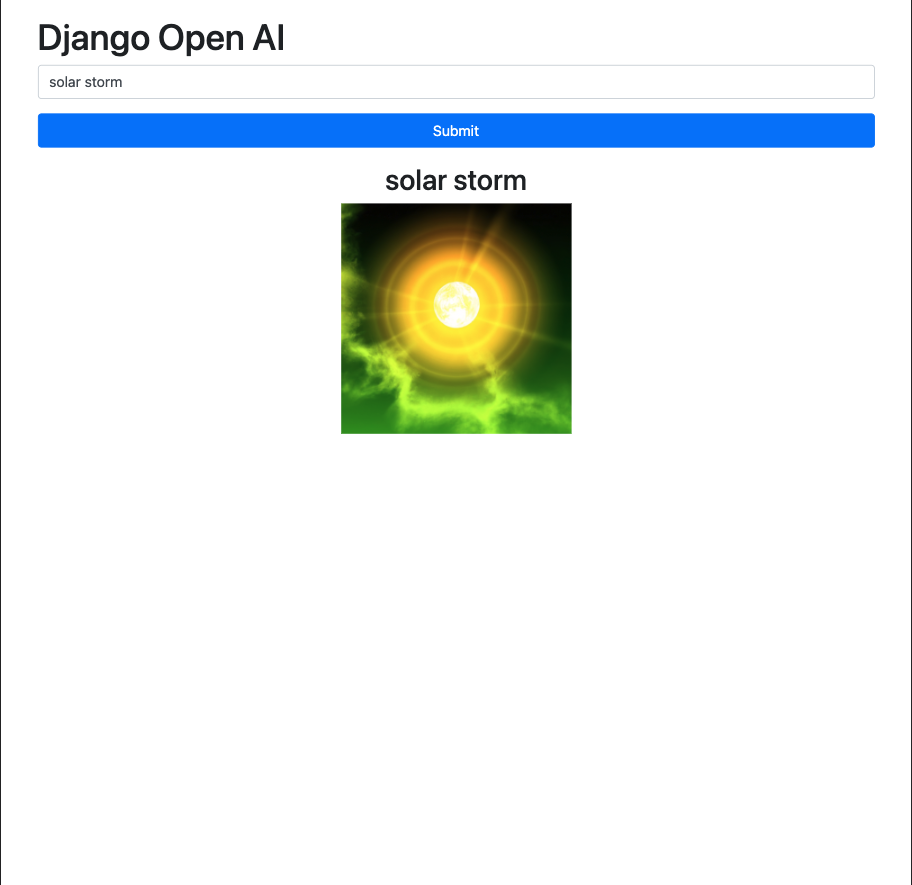
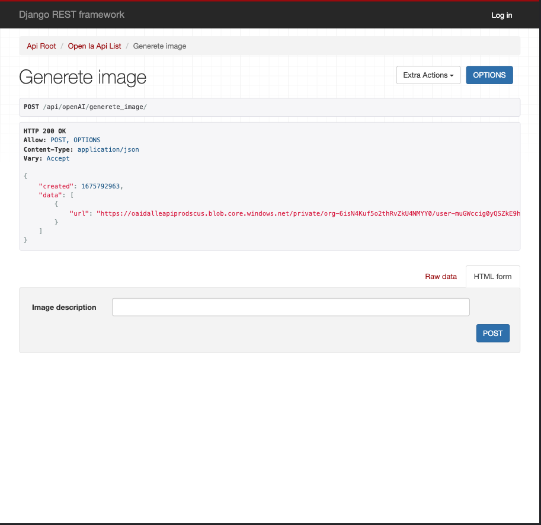

<h1 align="center">
  DjangoOpenAI
</h1>

## Introduction
  This project is built using Django, a high-level Python web framework that enables rapid development and clean, pragmatic design and also it's an introduction to openai

-------

## Requirements
  - Before running this project, you will need to have the following software installed:
      - Python 4x | 3.x 
      - Django 4x | 3.x 
      - Django Rest Framework 4.x | 3.x
      - PostgreSQL (or any other database supported by Django)
  - API Key from https://platform.openai.com/

---

## Getting Started
  1. Clone this repository: git clone https://github.com/lscavalcante/DjangoOpenAI.git
  2. Navigate to the project directory: cd [DjangoOpenAI]
  3. Create a virtual environment: python -m venv venv
  4. Activate the virtual environment: source venv/bin/activate
  5. Install the required packages: pip install -r requirements.txt
  6. Update the local settings file with your database and other configuration settings.
  7. Run the migrations: python manage.py migrate
  8. create a file .env and configure it
  9. Start the development server: python manage.py runserver

## API Routes
  - API
    - http://localhost:8000/api/openAI/generete_image/ -> POST
  - WEB
    - http://localhost:8000/web/openAI/

## 🌎 Screens

## WEB

| Web | Result |
| --- | --- 
|  |  |

---

## API

| API | Result |
| --- | --- 
|  |  |